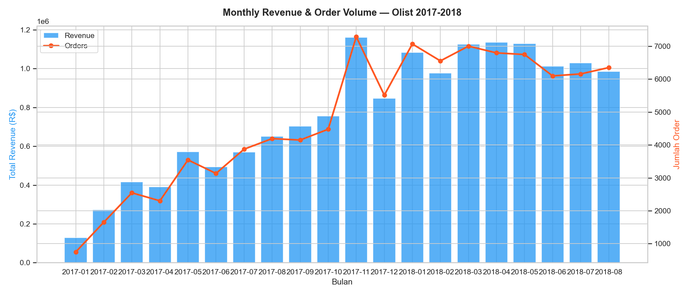
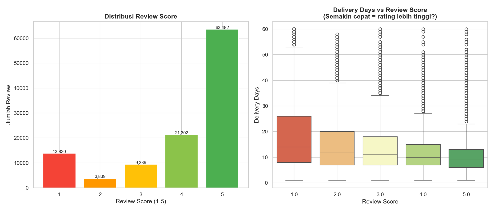
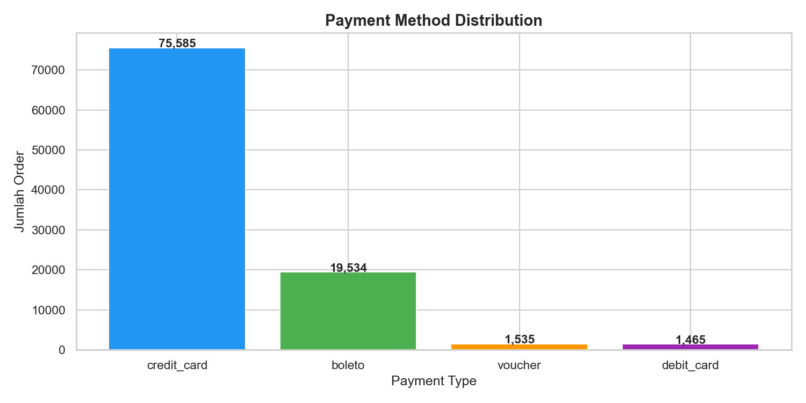

# 🛒 Brazilian E-Commerce Analytics — Olist Dataset

An end-to-end data analytics portfolio project covering SQL data engineering, Python exploratory data analysis, and an interactive Tableau dashboard — built on the [Brazilian E-Commerce Public Dataset by Olist](https://www.kaggle.com/datasets/olistbr/brazilian-ecommerce) (Kaggle).

---

## 📌 Project Overview

Olist is a Brazilian marketplace platform connecting small businesses to major e-commerce channels. This project analyzes **~100K orders** placed between 2016–2018 to uncover revenue trends, delivery performance, customer satisfaction patterns, and top-performing product categories.

**Key questions answered:**
- How did revenue and order volume grow over time?
- Which product categories drive the most revenue?
- Does faster delivery actually lead to higher review scores?
- What are the most popular payment methods?
- How does delivery performance vary across Brazilian states?

---

## 📁 Struktur Project

```
olist-ecommerce/
├── data/raw/          # Dataset asli dari Kaggle (tidak diedit)
├── data/processed/    # Data hasil cleaning untuk dashboard
├── sql/               # Query PostgreSQL (create, cleaning, analysis)
├── notebooks/         # Jupyter notebooks EDA & analysis
├── output/figures/    # Chart PNG dari Python
└── dashboard/         # Links ke Tableau & Looker Studio
```

---

## 🛠️ Tech Stack

| Layer | Tool |
|---|---|
| Data Storage | PostgreSQL |
| Data Wrangling | SQL (cleaning & analysis queries) |
| EDA & Visualization | Python (pandas, matplotlib, seaborn, SQLAlchemy) |
| Dashboard | Tableau Public |
| Environment | python-dotenv, Jupyter Notebook |

---

## 🔄 Workflow

### 1. Data Ingestion & Storage (SQL)
Raw CSV files from Kaggle were imported into a **PostgreSQL** database. Schema design follows the original Olist relational model (orders, customers, products, sellers, reviews, payments, geolocation).

### 2. Data Cleaning (SQL)
Key cleaning steps performed in SQL:
- Joined all relevant tables into a single `clean_orders_master` view
- Filtered out cancelled/unavailable orders where appropriate
- Computed derived columns: `delivery_days`, `delivery_status` (On Time / Late), `year_month`, `total_item_value`
- Handled missing values in review scores and delivery timestamps

### 3. Exploratory Data Analysis (Python)
Loaded the clean master table from PostgreSQL via SQLAlchemy and performed EDA across five analytical areas:

- **Revenue Trend** — Monthly revenue & order volume (2017–2018)
- **Top Categories** — Top 10 product categories by total revenue
- **Delivery Performance** — On-time vs late delivery rates, delivery day distribution
- **Review Score Analysis** — Score distribution + correlation between delivery speed and review rating (Pearson r)
- **Payment Methods** — Order volume and average value by payment type

### 4. Dashboard (Tableau)
Interactive dashboard built in Tableau Public with filters by state, date range, and product category.

🔗 **[View Live Dashboard →](https://public.tableau.com/views/OlistE-CommerceSalesDashboard_17794179297180/BrazilianE-CommercePerformanceDashboard)**

---

## 📊 Key Findings

**Revenue Growth**
Revenue grew consistently throughout 2017, peaking in **November 2017** — aligned with Black Friday / Cyber Monday in Brazil — before stabilizing into 2018.

**Top Categories**
`health_beauty` led all categories with **R$ 1.4M+** in revenue, followed by `watches_gifts` and `bed_bath_table`. The top 10 categories collectively account for the bulk of total platform revenue.

**Delivery vs. Satisfaction**
Pearson correlation between delivery days and review score is **negative** — orders that arrived faster consistently received higher ratings. The boxplot shows a clear median delivery day drop from score 1 (slowest) to score 5 (fastest).

**Review Distribution**
The majority of customers (63,481) gave a **5-star rating**, but a notable 13,825 gave 1 star — suggesting a bimodal satisfaction pattern where customers either love or are strongly disappointed by the experience.

**Payment Methods**
Credit card dominates as the preferred payment method, often used with installments — reflecting typical Brazilian consumer behavior for larger purchases.

---

## 🖼️ EDA Preview




---

## ⚙️ Setup & Reproduction

### Prerequisites
- Python 3.9+
- PostgreSQL
- Kaggle account (to download the dataset)

### Installation

```bash
git clone https://github.com/YOUR_USERNAME/olist-ecommerce-analytics.git
cd olist-ecommerce-analytics
pip install -r requirements.txt
```

### Environment Variables
Copy `.env.example` to `.env` and fill in your PostgreSQL credentials:

```env
DB_USER=your_user
DB_PASS=your_password
DB_HOST=localhost
DB_PORT=5432
DB_NAME=olist_db
```

### Run
1. Download the dataset from [Kaggle](https://www.kaggle.com/datasets/olistbr/brazilian-ecommerce) and place CSVs in `data/raw/`
2. Run SQL scripts in order: `01_import_schema.sql` → `02_cleaning.sql` → `03_analysis_queries.sql`
3. Open and run `notebooks/01_eda.ipynb`

---

## 📄 Data Source

> Olist. (2018). *Brazilian E-Commerce Public Dataset by Olist*. Kaggle.
> https://www.kaggle.com/datasets/olistbr/brazilian-ecommerce

Licensed under [CC BY-NC-SA 4.0](https://creativecommons.org/licenses/by-nc-sa/4.0/).

---

## 👤 Author

**[Your Name]**
[LinkedIn](https://linkedin.com/in/your-profile) · [Tableau Public](https://public.tableau.com/app/profile/your-profile) · [GitHub](https://github.com/YOUR_USERNAME)
